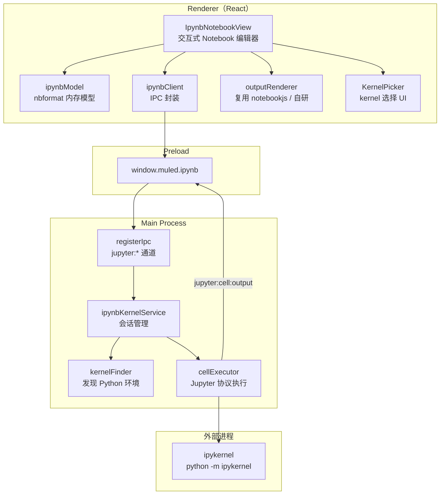
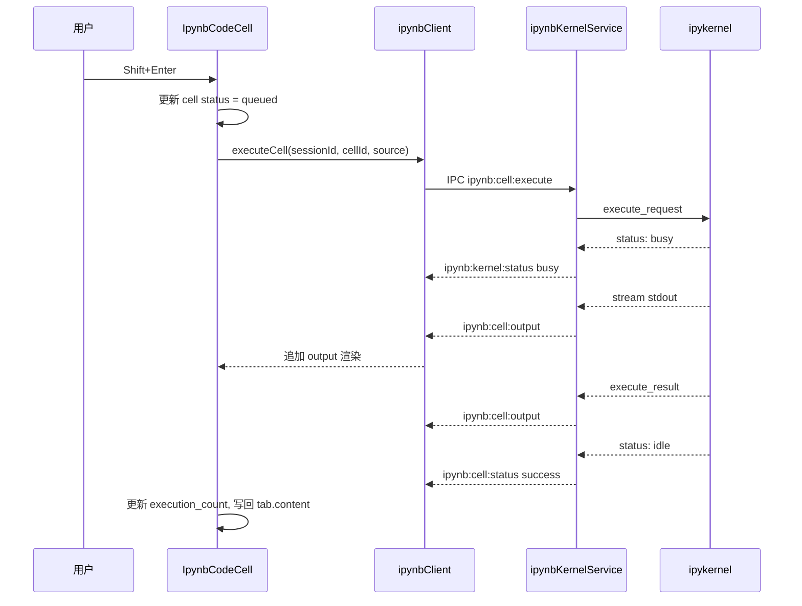

# Muled `.ipynb` Kernel 连接与编辑运行 — 实现方案

> 文档版本：v0.2  
> 日期：2026-06-30  
> 状态：Phase 2 已完成，Phase 3 待开始

---

## 1. 背景与目标

### 1.1 现状

Muled 已具备 `.ipynb` 的基础支持：

| 能力 | 实现位置 | 说明 |
|------|----------|------|
| 文件打开/保存 | `useEditorTabs.ts` | `kind: 'ipynb'`，整文件 JSON 字符串 |
| 静态预览 | `IpynbPreview.tsx` + `renderIpynb.ts` | 基于 `notebookjs`，渲染已有 outputs |
| 源码编辑 | `TabContent.tsx` | `viewMode: 'source'`，CodeMirror JSON 编辑 |
| 视图切换 | `IpynbViewSwitch.tsx` | `preview` ↔ `source` |
| 语法高亮 | `notebookHighlighter.ts` | Prism + KaTeX |

**缺失能力：** 无 kernel 发现/选择、无 cell 级执行、无运行时 output 回写、无执行状态 UI。

### 1.2 目标

在 Muled 中为 `.ipynb` 提供 **连接 kernel、编辑 cell、运行代码、展示输出** 的完整 Notebook 体验，同时：

- 复用现有 Tab / IPC / 工具路径检测 / 输出渲染基础设施
- 与 Bun、Scheme 执行模式保持架构一致性
- 分阶段交付，先 Python kernel，再扩展其他语言

### 1.3 非目标（首期）

- 不支持 JupyterLab 扩展（widgets 仅做 best-effort 渲染）
- 不支持远程 Jupyter Server（可作为 Phase 3 扩展）
- 不实现 VS Code 级别的 debug adapter / variable explorer
- 不替换现有 `source` 视图（保留 JSON 源码编辑作为高级模式）

---

## 2. 架构参考

### 2.1 VS Code 分层（调研结论摘要）

```
.ipynb 文件
  → 内置 ipynb 扩展（NotebookSerializer）     # 读写 nbformat
  → NotebookEditorWidget（核心 UI）            # cell 编辑
  → INotebookKernelService（kernel 绑定）      # 核心编排
  → ms-toolsai.jupyter（NotebookController）   # kernel 实现
  → Jupyter 协议（@jupyterlab/services）       # 与 ipykernel 通信
```

### 2.2 Muled 对标分层

Muled 无 Extension Host，采用 **Main 进程服务 + Renderer React UI** 的扁平架构：

```
.ipynb 文件
  → ipynbModel（Renderer/Main 共享类型）       # 解析/序列化 nbformat
  → IpynbNotebookView（Renderer UI）           # 交互式 cell 编辑器
  → ipynbKernelService（Main）                 # kernel 生命周期 + 协议
  → ipynbClient（Renderer IPC 封装）           # 与 Bun/Scheme client 同模式
  → Python ipykernel 子进程                    # Jupyter messaging
```

---

## 3. 总体架构



### 3.1 新增 viewMode

在现有 `preview` / `source` 基础上增加 **`notebook`** 模式：

| viewMode | 用途 | 默认 |
|----------|------|------|
| `notebook` | 交互式编辑 + 执行（新） | ✅ 打开 `.ipynb` 时默认 |
| `preview` | 静态只读渲染（保留） | |
| `source` | JSON 源码编辑（保留） | |

`IpynbViewSwitch` 扩展为三态切换：`Notebook | Preview | Source`。

---

## 4. 数据模型

### 4.1 依赖

引入 `@jupyterlab/nbformat` 作为 nbformat 类型与校验来源（VS Code 内置 ipynb 扩展同款）。

### 4.2 核心类型（`src/shared/types/ipynb.ts`）

```typescript
/** 与磁盘 .ipynb JSON 对应的结构化模型 */
export interface IpynbDocument {
  nbformat: number;
  nbformat_minor: number;
  metadata: IpynbMetadata;
  cells: IpynbCell[];
}

export interface IpynbCell {
  id?: string;
  cell_type: 'code' | 'markdown' | 'raw';
  source: string;           // 规范化后的单行字符串（内部）；序列化时拆为 string[]
  metadata: Record<string, unknown>;
  outputs?: IpynbOutput[];  // code cell only
  execution_count?: number | null;
}

/** 运行时状态（不写入磁盘，仅内存） */
export interface IpynbRuntimeState {
  kernelId: string | null;
  kernelStatus: 'disconnected' | 'connecting' | 'idle' | 'busy' | 'error';
  cellStates: Map<string, IpynbCellRuntimeState>;  // key = cell.id
}

export interface IpynbCellRuntimeState {
  status: 'idle' | 'queued' | 'running' | 'success' | 'error';
  error?: string;
}
```

### 4.3 解析与序列化（`src/shared/ipynb/nbformat.ts`）

| 函数 | 职责 |
|------|------|
| `parseIpynbJson(raw: string): IpynbDocument` | JSON → 结构化模型；`source` 数组 join 为 `\n` |
| `serializeIpynb(doc: IpynbDocument): string` | 结构化模型 → JSON；保留 indent（读入时记录 `metadata.indentAmount`） |
| `ensureCellIds(doc: IpynbDocument): void` | 为无 `id` 的 cell 生成 UUID |
| `createEmptyNotebook(language?: string): IpynbDocument` | 新建 notebook 模板 |

### 4.4 Tab 状态扩展

`EditorTab`（`src/renderer/types/tab.ts`）对 `ipynb` 类型：

- `content: string` — 保留，作为序列化后的 JSON（与磁盘同步）
- 新增可选字段 `ipynbRuntime?: IpynbRuntimeState` — 仅内存，tab 关闭时丢弃
- 默认 `viewMode` 从 `'preview'` 改为 `'notebook'`

---

## 5. Kernel 管理（Main 进程）

### 5.1 设计原则

参照现有 `bunPtyService` / `schemePtyService` 模式：

- 按 `webContentsId` + `notebookKey`（tab URI）管理会话
- 窗口销毁 / tab 切换时清理
- 工具路径通过 `toolPathService` + 设置页配置

### 5.2 Kernel 发现（`kernelFinder.ts`）

首期支持本地 Python kernel：

| 来源 | 检测方式 |
|------|----------|
| 设置中配置的 `python` 路径 | `config.tools.python` |
| `python3` / `python` on PATH | `toolPathService.detectTools()` |
| 已安装 venv / conda 环境 | `python -m jupyter kernelspec list` 或扫描 `~/.local/share/jupyter/kernels` |
| ipykernel 可用性 | `python -c "import ipykernel"` |

返回 `KernelSpec[]`：

```typescript
export interface KernelSpec {
  id: string;              // 唯一标识，如 "python:3.11.5:/usr/bin/python3"
  displayName: string;     // "Python 3.11.5"
  language: string;        // "python"
  pythonPath: string;
  argv?: string[];           // kernel 启动参数（kernelspec）
}
```

### 5.3 Kernel 会话（`ipynbKernelService.ts`）

```typescript
interface KernelSession {
  sessionId: string;
  webContentsId: number;
  notebookKey: string;       // tab 标识（relativePath 或 untitled id）
  spec: KernelSpec;
  connection: JupyterConnection;  // 封装 ZMQ 或 stdio 通道
  status: KernelStatus;
}
```

**生命周期：**

```
discover → start(spec) → ready → execute(cells) → interrupt / restart → dispose
```

**启动方式（首期）：**

使用 `python -m ipykernel -f {connection_file}` 启动子进程。连接文件由 Main 进程生成，通过 Jupyter connection file 协议通信。

> **技术选型说明：** Jupyter kernel 标准通道为 ZMQ（5 个 socket）。Node.js 可用 `zeromq` 包实现。备选方案是用 `@jupyterlab/services` 的 `KernelManager`（依赖较重但协议完整）。推荐首期使用 `@jupyterlab/services`，减少自研协议风险。

### 5.4 执行队列（`cellExecutor.ts`）

- 同一 notebook 的 cell 顺序执行（队列），与 Jupyter 行为一致
- 支持 `interrupt`（`kernel_interrupt_request`）
- 支持 `restart`（重启 kernel，清空 execution_count）
- 流式 output 通过 IPC 事件推送到 Renderer

---

## 6. IPC 设计

### 6.1 通道定义（扩展 `src/shared/types/ipc.ts`）

**Invoke 通道：**

| Channel | 请求 | 响应 |
|---------|------|------|
| `ipynb:kernel:list` | `{ workspaceRoot? }` | `{ kernels: KernelSpec[] }` |
| `ipynb:kernel:start` | `{ notebookKey, specId }` | `{ sessionId, status }` |
| `ipynb:kernel:restart` | `{ sessionId }` | `{ status }` |
| `ipynb:kernel:interrupt` | `{ sessionId }` | `void` |
| `ipynb:kernel:dispose` | `{ sessionId }` | `void` |
| `ipynb:cell:execute` | `{ sessionId, cellId, source, silent? }` | `{ msgId }` |
| `ipynb:cell:complete` | `{ sessionId, cellId, source, cursorPos }` | `{ matches: string[] }` |

**Push 事件（Main → Renderer）：**

| Event | Payload |
|-------|---------|
| `ipynb:kernel:status` | `{ sessionId, status, error? }` |
| `ipynb:cell:output` | `{ sessionId, cellId, output: IpynbOutput }` |
| `ipynb:cell:executeInput` | `{ sessionId, cellId, executionCount }` |
| `ipynb:cell:status` | `{ sessionId, cellId, status }` |
| `ipynb:cell:clearOutputs` | `{ sessionId, cellId }` |

### 6.2 Preload 门面

```typescript
// window.muled.ipynb
{
  listKernels: () => Promise<KernelSpec[]>;
  startKernel: (args) => Promise<StartKernelResult>;
  restartKernel: (sessionId) => Promise<void>;
  interruptKernel: (sessionId) => Promise<void>;
  disposeKernel: (sessionId) => Promise<void>;
  executeCell: (args) => Promise<void>;
  onKernelStatus: (cb) => () => void;
  onCellOutput: (cb) => () => void;
  onCellStatus: (cb) => () => void;
}
```

### 6.3 会话生命周期（Renderer）

参照 `bunTerminalSessionLifecycle.ts`：

```typescript
// src/renderer/lib/ipynb/ipynbKernelSessionLifecycle.ts
export function shouldDisposeIpynbKernelOnTabChange(
  previous: IpynbTabContext,
  next: IpynbTabContext,
): boolean;

export function disposeIpynbKernelSession(args: {
  sessionIdRef: { current: string | null };
  dispose: (sessionId: string) => void;
}): void;
```

**策略：**

- 切换 tab（离开 ipynb）→ 保持 kernel 运行（用户可能切回）
- 关闭 tab → dispose kernel
- 切换工作区 → dispose 所有 kernel
- 应用退出 → Main `before-quit` 统一清理

---

## 7. Renderer UI 设计

### 7.1 组件结构

```
src/renderer/components/editor/ipynb/
├── IpynbNotebookView.tsx        # 主容器（替代 preview 作为默认视图）
├── IpynbNotebookToolbar.tsx     # 运行全部 / 重启 / 清除输出 / kernel 选择
├── IpynbKernelPicker.tsx        # kernel 下拉选择
├── IpynbCellList.tsx            # 虚拟化 cell 列表（cell 较多时）
├── IpynbMarkdownCell.tsx        # Markdown cell（编辑/渲染双态）
├── IpynbCodeCell.tsx            # Code cell（编辑器 + 运行按钮 + 输出区）
├── IpynbRawCell.tsx             # Raw cell
├── IpynbCellOutput.tsx          # 单条 output 渲染
├── IpynbCellToolbar.tsx         # cell 级操作（运行/删除/上移/下移）
└── ipynb-notebook.css
```

### 7.2 Code Cell 编辑器

- 使用 **CodeMirror 6**（项目已有），按 `metadata.language` 或 notebook `kernelspec` 选择语言包
- 左侧显示 `In [n]:` / `Out [n]:` 执行计数
- 工具栏：▶ Run、⏹ Interrupt（全局）、清除 output
- 快捷键：`Shift+Enter` 运行当前 cell 并跳转下一 cell；`Ctrl+Enter` 运行但不跳转

### 7.3 Markdown Cell

- 未聚焦：渲染 Markdown（复用 `marked` + KaTeX，与 `notebookHighlighter` 一致）
- 聚焦/双击：切换为 CodeMirror 编辑
- `Shift+Enter`：渲染并跳转下一 cell

### 7.4 Output 渲染

复用并扩展现有 `renderIpynb.ts` / `notebookjs` 能力：

| output_type | 渲染方式 |
|-------------|----------|
| `stream` (stdout/stderr) | `<pre>` + AnsiUp（已有） |
| `execute_result` / `display_data` | 按 `mimeType` 分发 |
| `text/plain` | `<pre>` |
| `text/html` | DOMPurify sanitize 后 innerHTML（已有） |
| `image/png`, `image/jpeg` | `` |
| `application/json` | 格式化 JSON |
| `text/latex` | KaTeX（已有） |
| `application/vnd.plotly.v1+json` | 可复用 CSV 查询中的 Plotly 集成 |

新增：**流式追加 output**（不等 cell 执行完毕再渲染）。

### 7.5 Kernel 选择器

顶部工具栏显示当前 kernel 名称与状态指示灯：

```
[ Python 3.11.5 ● idle ▾ ]  [↻ Restart]  [■ Interrupt]  [▶▶ Run All]
```

- 无 kernel 时显示 `Select Kernel`
- 首次执行 cell 时若未选 kernel，弹出选择器（MRU 优先）
- 设置页增加 Python 路径与 ipykernel 安装提示

---

## 8. 执行流程



### 8.1 保存策略

- 执行完成后，将新 outputs 合并入 `IpynbDocument`，序列化写回 `tab.content`
- `tab.dirty = true`，用户 Cmd+S 时走现有 `file:write` 保存到磁盘
- 可选：执行后自动保存（设置项 `ipynb.autoSaveOnRun`，默认 `false`）

---

## 9. 设置与工具检测

### 9.1 设置页扩展（`SettingsDialog.tsx`）

| 设置项 | 说明 |
|--------|------|
| `tools.python` | Python 可执行文件路径 |
| `ipynb.defaultKernel` | 默认 kernel spec id |
| `ipynb.autoSaveOnRun` | 执行后自动保存 |
| `ipynb.executionTimeout` | 单 cell 超时（秒，默认 300） |

### 9.2 工具检测扩展（`toolPathService.ts`）

在 `DetectToolsResult` 中增加：

```typescript
python?: { path: string; version: string };
ipykernel?: { available: boolean; version?: string };
```

---

## 10. 分阶段交付计划

### Phase 1 — 交互式 Notebook 编辑器（无 kernel）

**目标：** 可编辑 cell 内容、增删/移动 cell、保存为合法 `.ipynb`，不执行。

| 任务 | 文件 | 状态 |
|------|------|------|
| nbformat 解析/序列化 | `src/shared/ipynb/nbformat.ts` | ✅ |
| 共享类型 | `src/shared/types/ipynb.ts` | ✅ |
| `notebook` viewMode | `editorViewMode.ts`, `useEditorTabs.ts` | ✅ |
| IpynbNotebookView 及 cell 组件 | `src/renderer/components/editor/ipynb/*` | ✅ |
| 三态视图切换 | `IpynbViewSwitch.tsx` | ✅ |
| TabContent 路由 | `TabContent.tsx` | ✅ |
| 单元测试 | `src/__tests__/ipynbNbformat.test.ts` | ✅ |

**验收：** 打开 `.ipynb` 进入 notebook 视图，可编辑 markdown/code cell，保存后文件可被 Jupyter / VS Code 正常打开。

**已实现要点（2026-06-30）：**

- 新增 `notebook` viewMode，打开 `.ipynb` 默认进入交互式编辑器
- `IpynbNotebookView`：cell 列表、Code/Markdown/Raw 编辑、增删/移动/改类型
- Markdown cell 双击或点「编辑」进入 CodeMirror；Shift+Enter 完成并跳转下一 cell
- Code cell 显示 `In [n]:` 提示符，复用 `notebookjs` 渲染已有 outputs
- 工具栏提示「Kernel 执行将在后续版本提供」
- 视图切换 Notebook | Preview | Source 三态保留

### Phase 2 — 本地 Python Kernel 执行

**目标：** 连接本地 ipykernel，单 cell 执行，流式 output。

| 任务 | 文件 | 状态 |
|------|------|------|
| Kernel 发现 | `src/main/services/ipynb/kernelFinder.ts` | ✅ |
| Kernel 会话管理 | `src/main/services/ipynb/ipynbKernelService.ts` | ✅ |
| Python kernel bridge | `src/main/services/ipynb/pythonKernelBridgeScript.ts` | ✅ |
| IPC 注册 | `ipc.ts`, `registerIpc.ts`, `preload.ts` | ✅ |
| Renderer client | `src/renderer/lib/ipynb/ipynbClient.ts` | ✅ |
| Kernel 选择器 + 工具栏 | `IpynbKernelPicker.tsx`, `IpynbNotebookToolbar.tsx` | ✅ |
| 执行状态 + output | `IpynbCodeCell.tsx`, `IpynbCellOutput.tsx` | ✅ |
| 设置/工具检测 | `SettingsDialog.tsx`, `toolPathService.ts` | ✅ |
| 单元测试 | `ipynbModel.test.ts`, `ipynbKernelSessionLifecycle.test.ts` | ✅ |

**验收：** 选择 Python kernel，运行 `print("hello")` 看到输出；运行 matplotlib 看到图片 output；保存后 output 写入 `.ipynb`。

**已实现要点（2026-06-30）：**

- Main 进程启动 **Python kernel bridge** 子进程（IPython `run_cell` + stdlib fallback），JSON 行协议通信，避免 ZMQ 原生模块依赖
- `ipynb:kernel:*` / `ipynb:cell:execute` IPC + 事件推送（`kernel:status`、`cell:status`、`cell:executeReply`）
- 工具栏 Kernel 选择器、重启/中断/Run All；Code cell ▶ 与 Shift+Enter 执行
- 设置页新增 **Python** 路径；自动检测 PATH 中的 python3
- 执行结果写回 cell `outputs` / `execution_count`，保存即持久化

**实现说明：** Phase 2 采用 embedded Python bridge 而非完整 Jupyter ZMQ 协议（见 §12 风险对策）。后续 Phase 3/4 可升级为 `@jupyterlab/services` + ipykernel 标准连接。

### Phase 3 — 体验完善

| 任务 | 说明 | 状态 |
|------|------|------|
| Run All / Run Above / Run Below | 批量执行 | ⬜ Run All ✅，其余待做 |
| Kernel restart / interrupt | 完整生命周期 | ✅ |
| MRU kernel 列表 | 记住最近使用的 kernel | ⬜ |
| 自动选择 kernel | 读取 `.ipynb` metadata `kernelspec` | ⬜ |
| 执行超时 & 错误展示 | tracebacks 渲染 | ✅（bridge 输出 error） |
| 未安装 ipykernel 引导 | 提示 `pip install ipykernel` | ✅ |

### Phase 4 — 扩展（可选）

| 任务 | 说明 |
|------|------|
| 远程 Jupyter Server | HTTP/WebSocket 连接已有 server |
| Bun/JS kernel | 对接 `@bun` 或 `deno jupyter` |
| Widget 支持 | `application/vnd.jupyter.widget-view+json` |
| 虚拟滚动 | 大型 notebook 性能优化 |

---

## 11. 文件结构规划

```
src/
├── shared/
│   ├── types/
│   │   └── ipynb.ts                    # 新增
│   └── ipynb/
│       ├── nbformat.ts                 # 解析/序列化
│       └── outputMime.ts               # MIME 类型工具
├── main/
│   └── services/
│       └── ipynb/
│           ├── kernelFinder.ts
│           ├── ipynbKernelService.ts
│           ├── cellExecutor.ts
│           └── jupyterConnection.ts    # ZMQ / @jupyterlab/services 封装
└── renderer/
    ├── lib/
    │   └── ipynb/
    │       ├── ipynbClient.ts
    │       ├── ipynbKernelSessionLifecycle.ts
    │       └── ipynbModel.ts           # React 外的纯逻辑
    └── components/
        └── editor/
            └── ipynb/
                ├── IpynbNotebookView.tsx
                ├── IpynbNotebookToolbar.tsx
                ├── IpynbKernelPicker.tsx
                ├── IpynbCellList.tsx
                ├── IpynbMarkdownCell.tsx
                ├── IpynbCodeCell.tsx
                ├── IpynbRawCell.tsx
                ├── IpynbCellOutput.tsx
                ├── IpynbCellToolbar.tsx
                └── ipynb-notebook.css
```

---

## 12. 依赖评估

| 依赖 | 用途 | 体积/风险 |
|------|------|-----------|
| `@jupyterlab/nbformat` | nbformat 类型 | 小，VS Code 同款 |
| `@jupyterlab/services` | Jupyter 协议客户端 | 中，减少自研风险 |
| `zeromq` | ZMQ 通信（若不用 services 内置） | 原生模块，Electron 需 rebuild |
| 现有 `notebookjs` | 静态 output 渲染 | 已有 |
| 现有 `ansi_up` | stdout 着色 | 已有 |
| 现有 `katex` / `marked` | 数学/Markdown | 已有 |

**推荐：** Phase 2 直接使用 `@jupyterlab/services` 的 `KernelManager` + `KernelConnection`，与 VS Code Jupyter 扩展同路线，避免手动实现 ZMQ 5-channel 协议。

---

## 13. 风险与对策

| 风险 | 影响 | 对策 |
|------|------|------|
| `zeromq` 原生模块与 Electron ABI | 构建失败 | 优先用 `@jupyterlab/services`；或 Phase 2 用 stdio 子进程 + `--JupyterTransport=ipc`（若可行） |
| ipykernel 未安装 | 无法执行 | 工具检测 + 设置页引导安装 |
| 大 notebook 性能 | UI 卡顿 | Phase 1 用简单列表，Phase 4 引入虚拟滚动 |
| output MIME 兼容性 | 渲染缺失 | 回退为 `text/plain`；记录 warn |
| Widget 交互 | 无法操作 ipywidgets | 首期显示静态快照或提示安装 Jupyter |
| 多 tab 共享 kernel | 资源浪费 | 首期每 tab 独立 kernel；后续可按 kernel spec 复用 |

---

## 14. 测试策略

| 层级 | 内容 |
|------|------|
| 单元测试 | `nbformat.ts` 解析/序列化 round-trip；`shouldDisposeIpynbKernelOnTabChange` |
| 集成测试 | `kernelFinder` mock PATH；`cellExecutor` mock kernel 响应 |
| 手工测试 | 打开经典 `.ipynb`（含 markdown/code/outputs）；执行、保存、用 VS Code 交叉验证 |

测试文件：

```
src/__tests__/
├── ipynbNbformat.test.ts
├── ipynbKernelSessionLifecycle.test.ts
└── ipynbKernelService.test.ts
```

---

## 15. 与现有代码的集成点

| 现有模块 | 集成方式 |
|----------|----------|
| `useEditorTabs.ts` | 默认 `viewMode: 'notebook'`；加载时 `parseIpynbJson` |
| `TabContent.tsx` | 路由 `showIpynbNotebook` |
| `IpynbViewSwitch.tsx` | 三态切换 |
| `isEditableTextTab` | `ipynb` 保持可编辑/可保存 |
| `registerIpc.ts` | 注册 `ipynb:*` handlers |
| `toolPathService.ts` | 检测 Python/ipykernel |
| `SettingsDialog.tsx` | Python 路径配置 |
| `renderIpynb.ts` | output 渲染逻辑抽取复用 |
| `notebookHighlighter.ts` | code cell 语法高亮 |
| `bunTerminalSessionLifecycle.ts` | 会话生命周期模式参考 |

---

## 16. 开放问题

1. ~~**默认视图：** 是否将 `notebook` 设为默认（推荐），还是保留 `preview`？~~ → **已决定：`notebook` 为默认**
2. **Kernel 共享：** 同一文件多 tab 打开时是否共享 kernel？
3. **自动 kernel 选择：** 是否根据 `kernelspec` 自动启动，还是始终手动选择？
4. **ipykernel 安装：** 是否提供一键 `pip install ipykernel`（需终端集成）？
5. **Bun kernel：** 是否在 Phase 4 前就为 `.ipynb` 中的 JavaScript cell 提供 Bun 执行（不走 Jupyter 协议）？

---

## 附录 A：与 VS Code 的能力对照

| 能力 | VS Code | Muled 方案 |
|------|---------|------------|
| 文件序列化 | 内置 ipynb 扩展 | `@jupyterlab/nbformat` + 自研 serializer |
| Cell 编辑 UI | NotebookEditorWidget | 自研 `IpynbNotebookView` |
| Kernel 注册 | NotebookController API | Main `ipynbKernelService` |
| Kernel 发现 | Jupyter 扩展 finder | `kernelFinder.ts` |
| 协议通信 | @jupyterlab/services | 同 |
| Output 渲染 | NotebookRenderer 扩展 | 复用 notebookjs + 自研 |
| Kernel 选择器 | notebookKernelView | `IpynbKernelPicker` |

## 附录 B：参考链接

- [VS Code Notebook API](https://code.visualstudio.com/api/extension-guides/notebook)
- [VS Code 内置 ipynb 扩展](https://github.com/microsoft/vscode/tree/main/extensions/ipynb)
- [VS Code Jupyter 扩展 kernel 架构](https://github.com/microsoft/vscode-jupyter/blob/main/.github/instructions/kernel.instructions.md)
- [Jupyter Notebook Format](https://nbformat.readthedocs.io/)
- [Jupyter Client Protocol](https://jupyter-client.readthedocs.io/en/stable/messaging.html)
